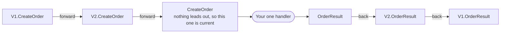
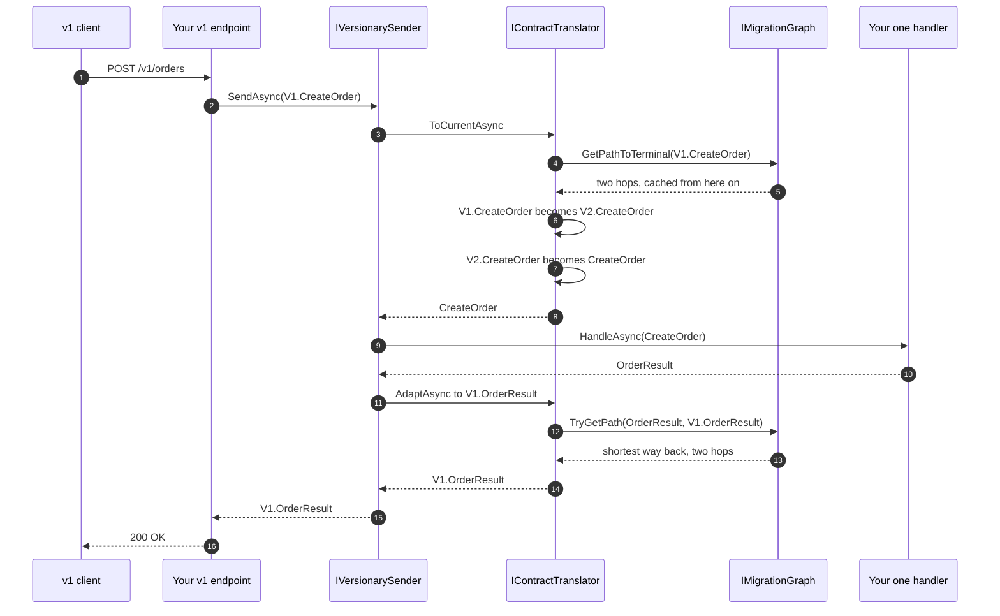
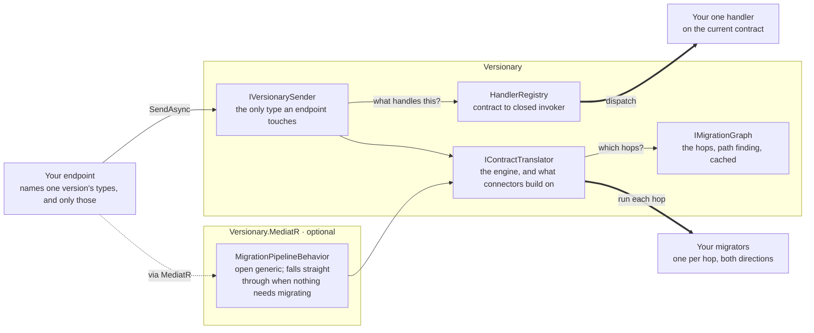
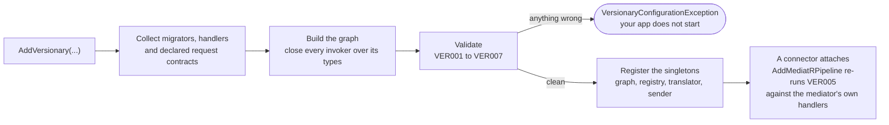

<h1 align="center">Versionary</h1>

<p align="center">
  <strong>Serve every version of your API from one handler.</strong>
</p>

<p align="center">
  <a href="LICENSE"></a>
  <a href="https://www.nuget.org/packages/Versionary"></a>
  <a href="https://www.nuget.org/packages/Versionary"></a>
  <a href="https://github.com/hiteshk97/versionary/actions/workflows/ci.yml"></a>
  
</p>

---

## How you got here

You shipped `CreateOrder`. It was clean.

Then finance wanted tax broken out on the response, so you added a flag. That's v2. Europe happened
and orders needed a currency, so that's v3. Payments asked for an idempotency key and you shipped v4.

Every one of those was the right call on the day you made it. That's what makes this so annoying.

You can't turn the old versions off. There's a mobile app whose release cycle you don't own. There's
a partner who integrated in 2022 and has no budget to look at it again. There are terminals sitting in
venues that get updated when somebody drives out there with a laptop.

So all four are live:

```
CreateOrderV1Handler  ─┐
CreateOrderV2Handler  ─┤   four handlers
CreateOrderV3Handler  ─┤   one actual behaviour
CreateOrderV4Handler  ─┘
```

Three of them are copies of the fourth with a field renamed. A pricing bug means four fixes. Audit
wants one more log line, that's four edits. Then one Friday somebody patches three of them, and from
that afternoon v2 charges tax differently from v4, and you find out five weeks later from a customer.

You know the escapes and you've probably already rejected them. Freeze the contract and the API never
improves again. Break the old clients and your release turns into a migration project you're running
on someone else's behalf. Branch on a version number inside one handler and you get a method with six
checks at the top that nobody wants to be the last to touch.

[`Asp.Versioning`](https://github.com/dotnet/aspnet-api-versioning) doesn't help here, good as it is.
It works out which version a request is. It says nothing about the duplication behind that.

## The idea

What if only the newest version had a handler?

An old request comes in. Before it reaches your code it gets reshaped into the current contract. Your
one handler runs. The result gets reshaped back into whatever the caller expected, and the old client
never notices.

A version stops costing you a handler and starts costing you a small transform.

```csharp
// Each version says what it returns. That never changes once a version ships.
public sealed record CreateOrder(...) : IRequestContract<OrderResult>;

// The only handler in the application.
public sealed class CreateOrderHandler : IVersionaryHandler<CreateOrder, OrderResult>
{
    public ValueTask<OrderResult> HandleAsync(CreateOrder request, CancellationToken ct)
        => /* ... the one and only implementation ... */;
}

// v1 callers still work, because of this.
public sealed class V1CreateOrderMigrator
    : IMigrator<V1.CreateOrder, V2.CreateOrder>,   // forward:  request goes up
      IMigrator<V2.OrderResult, V1.OrderResult>    // backward: result comes down
{
    public ValueTask<V2.CreateOrder> MigrateAsync(V1.CreateOrder input, CancellationToken ct)
        => new(new V2.CreateOrder(input.Items, IncludeTax: false));

    public ValueTask<V1.OrderResult> MigrateAsync(V2.OrderResult input, CancellationToken ct)
        => new(new V1.OrderResult(input.OrderId, input.Total));
}
```

One migrator per version. Delete the other three handlers.

## Stripe has been doing this since 2011

Not a new idea. Stripe has shipped close to a hundred backwards incompatible changes and retired
exactly zero versions. Code written against their API a decade ago still runs today. Brandur Leach
wrote up how in
[APIs as infrastructure: future-proofing Stripe with versioning](https://stripe.com/blog/api-versioning).
Go read it.

Versions are named after the date they shipped, like `2017-05-24`. Your account pins itself to
whatever was current on your first call and stays there until you move it, or until you override it
per request with the `Stripe-Version` header.

Here's the part that matters. Stripe doesn't keep a hundred copies of their code. They keep one, at
the newest version, plus a small module per breaking change that knows how to undo it. Each module
carries a note about the change, the resource types it touches, and the transformation itself.

A response gets built at the current version, then walked backwards through time, one module at a
time, until the shape matches what the caller is pinned to. Quoting the post, version changes "expect
to be automatically applied backwards from the current API version and in order."

That's the trick. A version costs one small isolated transform instead of a copy of your business
logic, and a hundred of them suddenly becomes survivable.

Versionary is that for .NET, with some deliberate differences in [How it works](#how-it-works).

## Install

```bash
dotnet add package Versionary --prerelease
dotnet add package Versionary.MediatR --prerelease   # only if you already use MediatR
```

`--prerelease` is required while the latest release is `1.0.0-rc.1`; it comes off once 1.0.0 ships.

| Package | What you get |
| --- | --- |
| **[`Versionary`](https://www.nuget.org/packages/Versionary)** | Everything. Graph, sender, dispatch. Depends on the DI and logging abstractions and nothing else. |
| **[`Versionary.Abstractions`](https://www.nuget.org/packages/Versionary.Abstractions)** | `IRequestContract<TResponse>`, `IMigrator<TFrom, TTo>` and `IVersionaryHandler<TRequest, TResponse>`, zero dependencies. Reference it from your contracts assembly. |
| **[`Versionary.MediatR`](https://www.nuget.org/packages/Versionary.MediatR)** | A pipeline behaviour, if you're already on MediatR. Optional. The core doesn't know MediatR exists. |

`net8.0` and `net10.0`. MIT.

## Getting started

Have each request contract declare what it returns, with `IRequestContract<TResponse>`. A v1 request
returns a v1 response, forever, so you may as well say it in the type system.

Write one handler for the current contract. That's where the behaviour lives, and it's the only copy
of it you'll have.

Write a migrator per hop. Put both directions in one class, since the request transform and the
response transform are two halves of the same decision about what changed.

Register them. One call finds both.

```csharp
builder.Services.AddVersionary(cfg => cfg.RegisterFromAssemblyContaining<Program>());
```

Then send.

```csharp
app.MapPost("/v1/orders", async (V1.CreateOrder body, IVersionarySender sender, CancellationToken ct) =>
    TypedResults.Ok(await sender.SendAsync(body, ct)));

app.MapPost("/orders", async (CreateOrder body, IVersionarySender sender, CancellationToken ct) =>
    TypedResults.Ok(await sender.SendAsync(body, ct)));
```

No response type at the call site. It comes from the contract, so asking a v1 request for a v2
response doesn't compile.

`IVersionarySender` is the only Versionary type an endpoint ever touches. Behind that call the request
climbs to whatever contract is current, the handler runs, and the result comes back down. None of it
shows up here.

Contracts you can't change, because they're generated or live in an assembly you don't own, go through
`SendAsync<TResponse>(request, ct)` instead and name the response themselves.

## Your endpoints never change

This is the whole promise, so it's worth being precise about why it holds.

A v1 endpoint names v1 types. Only v1 types. It sends a `V1.CreateOrder` and expects a
`V1.OrderResult`, and neither of those can ever change, because v1 is done. It shipped. Nothing you do
to v5 can reach backwards and touch it.

Say you're on `V1 → V2 → current` and tomorrow you add another version. What moves:

| | Changes? |
| --- | --- |
| The v1 endpoint | **No** |
| The v2 endpoint | **No** |
| A migrator for the new hop, both directions | Added |
| Your handler, now on the new contract | Changed |

Two files, and neither one is an endpoint. There's a test in the suite that runs the same v1 call
against both configurations and compares the answers, so this is checked rather than promised.

The obvious way to get burned is forgetting to move the handler forward when the chain grows, or
forgetting the response hop back. Both fail at startup rather than on somebody's oldest request. See
[Failing at startup](#failing-at-startup-not-at-3am).

## Already on MediatR?

Keep your handlers. Add the connector and you get the same guarantee through `ISender`.

```csharp
builder.Services.AddMediatR(cfg => cfg.RegisterServicesFromAssemblyContaining<Program>());

builder.Services
    .AddVersionary(cfg => cfg.RegisterFromAssemblyContaining<Program>())
    .AddMediatRPipeline();
```

```csharp
app.MapPost("/v1/orders", async (V1.CreateOrder body, ISender sender, CancellationToken ct) =>
    TypedResults.Ok(await sender.Send(body, ct)));
```

Your `IRequestHandler` implementations don't change and you never touch `IVersionaryHandler`. The
behaviour registers as an open generic, so requests with nothing to migrate cost one cached dictionary
lookup and fall through. Leave it in place even if two of your forty contracts are versioned.

## How it works

Versionary keeps a directed graph of typed transforms. A request walks forward until it hits a
contract with no way out. That one is current, and it's what your handler takes. A result searches for
the shortest way back to whatever the caller asked for.



Two things fall out of that.

**A contract with no migrator is already current.** That's how you pin a version. Give it its own
handler and no migrator and its requests arrive untouched. Use that for the version where behaviour
genuinely changed and reshaping the data would be a lie. Give it a migrator and no handler instead,
and it folds into the current contract. The choice is per endpoint, and nothing else in the app needs
to know which way you went.

**Fan-out is fine going back.** One current result can migrate down into several older shapes, because
the target you ask for picks the branch. Only the forward walk needs a single way onward.

### One request, start to finish

A client from three years ago posts an order.



1. Your endpoint binds the body to `V1.CreateOrder` and calls `SendAsync`. The response type comes
   from the contract. That code has no idea a migration is coming.
2. Versionary looks up `V1.CreateOrder`, finds one way out to `V2.CreateOrder`, runs it.
3. Looks up `V2.CreateOrder`, finds one way out to `CreateOrder`, runs it.
4. Looks up `CreateOrder`. Nothing. So this is current, and the walk stops.
5. Finds the handler registered for `CreateOrder` and runs it.
6. The handler returns an `OrderResult`. The caller wanted a `V1.OrderResult`, so Versionary searches
   for the shortest way between them and finds two steps.
7. Runs both. Hands back a `V1.OrderResult`.

Step four is the entire definition of "current". A contract is current because nobody wrote a migrator
leading away from it. And step six searches instead of following, which is why a result can reach any
older shape that's connected, not just the one directly behind it.

### Not every change can be migrated

Three kinds show up. Knowing which one you've got tells you what to do.

**Additive.** New optional field, new endpoint, new value in a response. Old clients ignore what they
don't recognise. Usually no migrator needed at all. If the new contract made something required, your
migrator supplies the default that matches the old behaviour.

**Shape.** Field renamed, split, merged, nested, moved from a string to a structured type. The
information is all still there, just arranged differently. This is what the library is for. Write the
migrator, delete the old handler.

**Behavioural.** The shape is identical and the meaning moved underneath it. Cancelling used to refund
immediately and now queues the refund. A total used to include tax and now doesn't. No transform can
express that, because the data was never what changed. Pin the old version to its own handler and take
the second copy. That's the right answer, not a failure.

One question settles it every time. Can you write a function from the old shape to the new one that
loses nothing a caller relied on? Yes, write a migrator. No, pin it.

### Where this differs from Stripe

**Requests migrate too.** Stripe's version changes mostly walk responses backwards. Versionary does
that and also brings requests forwards, so a caller can send an old shape and reach a handler that has
never heard of it.

**A graph, not a timeline.** Stripe applies modules in order, walking back through time. Versionary
holds hops as a graph and searches it, so it can skip versions that changed nothing relevant and fan
one result out to several older shapes. When versions sit in a straight line, which is most of the
time, the two behave identically.

**Pinning instead of gates.** Stripe uses small feature flags called gates for behaviour that changed
rather than shape. Versionary needs no equivalent. A contract with no migrator already routes to its
own handler.

### There's no such thing as a version in here

The graph knows one type can become another. It has no idea what a version is. Not dates, not
integers, not semver, not media types. Working out which version a message belongs to is your
transport's job.

That's deliberate. It's why the same engine serves HTTP APIs, queue consumers and event upcasters
without any of them agreeing on a versioning scheme. Pair it with `Asp.Versioning` and each does the
half it's actually good at.

## Architecture

Two ways in, one engine underneath. `Versionary.Abstractions` holds the interfaces you implement,
`Versionary` holds everything that runs, and the MediatR connector is an optional package on top — the
core has never heard of MediatR. Which package each piece lives in is in the table below.



Nothing on that path reflects. Every hop invoker and every handler invoker is closed over its contract
types once, while `AddVersionary` is still running:



## Failing at startup, not at 3am

A broken configuration throws while `AddVersionary` is still running, and everything wrong is reported
together so you fix it in one pass instead of one build per mistake.

```
The migration graph is invalid:
  Error VER002: The migration graph contains a cycle through 'Api.V2.CreateOrder'.
                Forward migration would never terminate.
  Error VER005: A handler is registered for 'Api.V2.CreateOrder', but that contract still
                migrates onward to 'Api.CreateOrder', so the handler can never run.
  Error VER006: 'Api.V1.CreateOrder' declares a response but nothing handles it. It migrates
                to 'Api.CreateOrder' first.
```

| | |
| --- | --- |
| `VER001` | The same hop registered twice |
| `VER002` | A cycle, so migrating forward would never finish |
| `VER003` | A contract *on a request path* with more than one way out, so nothing can choose a branch |
| `VER004` | A hop migrating a contract to itself |
| `VER005` | A handler on a contract that still migrates onward, so it can never run |
| `VER006` | A declared request contract that reaches no handler |
| `VER007` | It reaches a handler, but that handler's response can't get back to the declared shape |

The last three are what make the endpoint promise checkable rather than aspirational. Because
`IRequestContract<TResponse>` says what a version returns, startup can walk every declared contract to
its handler and back again, and prove the whole round trip. Add a version and forget to move the
handler, `VER005` or `VER006` stops the build. Add it and forget the response hop back, and `VER007`
does.

`VER007` is the one you'd otherwise find the hard way. Everything compiles, current requests work, and
only your oldest callers get a `MigrationPathNotFoundException`.

Contracts that skip the marker and name their response at the call site are invisible to all of this.
They fail on the first request instead.

`VER003` is reported only where the graph can prove the contract is on a request path — reachable
from a declared request contract, or able to reach a handler. A response fanning out to several older
shapes is the configuration this library exists to support, so it is never reported at all.

### Handlers your mediator owns

`VER005` needs to know where a chain ends, and a mediator's handlers are registered against the
mediator rather than against Versionary. `AddMediatRPipeline()` reads them off the service collection
and re-runs the check, so a version you pinned on purpose and then accidentally connected a migrator
to fails startup instead of being silently migrated past its own handler:

```csharp
builder.Services.AddMediatR(cfg => cfg.RegisterServicesFromAssemblyContaining<Program>());

builder.Services
    .AddVersionary(cfg => cfg.RegisterFromAssemblyContaining<V1OrderMigrator>())
    .AddMediatRPipeline();   // ← VER005 covers your IRequestHandlers from here
```

Register MediatR first. Afterwards is not an error, but there is nothing for the check to read and it
is skipped. Other connectors can do the same through `IVersionaryBuilder.ValidateHandledContracts`.

Same check in a unit test, in the spirit of AutoMapper's `AssertConfigurationIsValid`:

```csharp
[Fact]
public void MigrationGraphIsValid()
{
    var services = new ServiceCollection();
    var builder = services.AddVersionary(cfg => cfg.RegisterFromAssemblyContaining<Program>());

    builder.Graph.Validate().ThrowIfInvalid();
}
```

`Graph.Explain()` prints the version map. Good approval test, and better documentation than a diagram
somebody drew once and never updated.

```
Migration graph: 4 hops across 6 contracts
  Current.OrderResult -> V2.OrderResult -> V1.OrderResult
  V1.CreateOrder -> V2.CreateOrder -> Current.CreateOrder
```

Contracts get qualified only as far as it takes to tell them apart, so versions sharing a bare type
name stay readable.

## When it breaks

`IMigrationContext` records every hop applied to the message in flight. A stack trace won't tell you
the request arrived as a v1 contract and got reshaped twice before it hit your code. This will.

```csharp
catch (Exception ex)
{
    logger.LogError(ex, "Request failed. Migrations applied:\n{Migrations}", migrationContext);
    throw;
}
```

```
Forward: V1.CreateOrder -> V2.CreateOrder
Forward: V2.CreateOrder -> CreateOrder
```

A migrator that throws gives you `MigrationFailedException` naming the hop, with the original kept as
the inner exception so your error handling can still switch on it. A request that migrates to
something nothing handles gives you `VersionaryHandlerNotFoundException`, naming both what arrived and
what it became. When those two differ, the gap is almost always a handler left on the previous
version.

## Configuration

```csharp
builder.Services.AddVersionary(cfg =>
{
    // Finds migrators and handlers in one pass.
    cfg.RegisterFromAssemblyContaining<Program>();

    // Or name them.
    cfg.AddMigrator<CreateOrderMigrator>();
    cfg.AddHandler<CreateOrderHandler>();

    // Or skip the classes. These are the trim and AOT safe forms, and they get the
    // same startup round-trip check as the reflective ones: their contracts are named
    // at the call site, so reading them costs nothing in trim safety.
    cfg.AddMigration<V1.Ping, V2.Ping>(p => new V2.Ping(p.Message, Loud: false));
    cfg.AddMigration<V1.Quote, V2.Quote>(async (q, ct) =>
        new V2.Quote(q.Symbol, await rates.LookupAsync(q.Symbol, ct)));
    cfg.AddHandler<Ping, PingResult>((request, services, ct) =>
        new(new PingResult(request.Message)));

    cfg.MigratorLifetime = ServiceLifetime.Scoped;   // default
    cfg.HandlerLifetime = ServiceLifetime.Scoped;    // default
    cfg.TrackAppliedMigrations = true;               // default
    cfg.ValidateOnBuild = true;                      // default
    cfg.TreatValidationWarningsAsErrors = false;     // default
});
```

Migrations are async because they aren't always pure reshaping. Sometimes a newer contract carries
something an older client couldn't have sent, and the only honest way to fill it in is to go and look
it up. Reshaping that needs no I/O pays nothing for the signature, since `new ValueTask<TTo>(result)`
allocates neither a task nor a state machine.

### Migration strategies

MediatR connector only, since this is about how many times your pipeline sees a message.

`SinglePass` is the default. Walks every hop at once, dispatches once, however many versions the
request travelled.

`Reentrant` migrates one hop at a time and re-dispatches after each, so a behaviour registered against
one specific older contract still runs. A validator somebody wrote for the v1 request, say.

```csharp
.AddMediatRPipeline(options => options.Strategy = MigrationStrategy.Reentrant);
```

Same response either way. The trade-off is in [Limitations](#limitations).

## Migrating things that aren't requests

Not everything versioned is a request. An event written to a store three years ago has the shape it
had then, and reading it back means bringing it up to date. Same forward walk, no handler on the end
of it, so it gets its own small API.

```csharp
public sealed class EventReader(IContractTranslator translator)
{
    public async ValueTask<OrderPlaced> ReadAsync(object stored, CancellationToken ct)
        => (OrderPlaced)await translator.ToCurrentAsync(stored, ct);
}
```

`IContractTranslator` is the engine under `IVersionarySender` and what connectors build on:
`ToCurrentAsync`, `ToAsync<TTarget>`, `AdaptAsync<TTarget>` for a result that may already be the right
shape or null, `StepAsync` for a single hop, and `IsCurrent`. Most applications never touch it.

## Samples

Three of them in [`samples/`](samples), all runnable.

```bash
dotnet run --project samples/Versionary.Samples.Default  # start here: sender, no mediator
dotnet run --project samples/Versionary.Samples.Tour     # console tour of the engine
dotnet run --project samples/Versionary.Samples.MediatR  # the same idea, via MediatR
```

**Default** is the shortest complete example. Two files, three versions, one handler, no mediator
anywhere. Getting started above, running, with Swagger on `localhost:5090`.

**Tour** prints what the engine does at every step. Multi hop chains, all three registration styles,
`Explain()`, validation failures, response fan-out, every option, event upcasting.

**MediatR** puts the same idea behind the connector, with a pinned version and an async migrator that
looks up a field older clients couldn't send.

More in [`samples/README.md`](samples/README.md).

## About MediatR versions

MediatR 12.x is Apache-2.0. From 13.0.0 it moved to RPL-1.5 or a commercial licence. **Versionary is
MIT and depends on neither.** The connector is a separate optional package, and you don't need a
mediator at all to use this library.

The connector floors at MediatR 12.0.0 so it never pulls RPL-1.5 into your graph, and it works against
13.x and 14.x too. That wasn't free. MediatR changed `RequestHandlerDelegate<TResponse>` from
parameterless to taking a `CancellationToken`, so a connector that just calls `next()` throws
`MissingMethodException` on the other major. Versionary binds that call at run time and caches it per
response type. There's a test suite that runs the whole connector against both majors to keep it
honest.

## Performance

Nothing on the request path uses reflection. Every hop invoker and every handler invoker is closed
over its contract types once, at startup, so a hop costs a virtual call plus one boxed result and
dispatch is a dictionary lookup. Paths are cached, so repeat migrations never re-walk the graph.
Requests with nothing to migrate fall straight through.

## Trimming and AOT

The core is annotated for trimming. Assembly scanning, `AddMigrator<T>()` and `AddHandler<T>()` are
reflective and carry `[RequiresUnreferencedCode]` and `[RequiresDynamicCode]`, so a trimmed app gets a
real warning instead of a surprise at run time. The inline forms, `AddMigration<TFrom, TTo>` and
`AddHandler<TRequest, TResponse>`, are trim and AOT safe. Use those and your whole graph is static —
`AddVersionary` itself carries no annotation, so a graph built entirely from them warns about nothing.

This is checked rather than asserted. `tests/Versionary.TrimmingTests` is a real application built
entirely from the trim-safe surface; CI publishes it Native AOT with trim and AOT warnings treated as
errors, then runs the resulting binary. An unannotated reflective call, or an inline overload that
quietly stopped being AOT safe, fails the build there instead of in your publish.

```bash
dotnet publish tests/Versionary.TrimmingTests -c Release -o ./aot && ./aot/Versionary.TrimmingTests
```

## Limitations

**It reshapes data, not behaviour.** If a version differs in what it does rather than what it looks
like, migration can't help you. You pin it, that's a second handler, and Versionary saved you nothing
on that endpoint. Pinning is cheap and explicit here. The duplication is still duplication.

**Requests need exactly one way forward.** A contract gets one outgoing request hop. Where the graph
can prove a branching contract is on a request path, `VER003` fails startup; anywhere it can't, the
first request to arrive there throws `AmbiguousMigrationPathException`. Responses fan out freely,
because the target disambiguates.

**One handler per contract.** Two handlers on the same contract is a startup error. Almost always what
you want, but it means you can't fan one contract out to several handlers the way a notification
would.

**Contracts reference Versionary.** `IRequestContract<TResponse>` lives in `Versionary.Abstractions`,
so a contracts assembly has to take that dependency. It's a small, dependency-free package targeting
net8.0 and net10.0, but if your contracts sit in a netstandard2.0 library shared with a .NET Framework
client, they can't implement the marker. Use `SendAsync<TResponse>(request, ct)` for those and you lose
the startup checks on them, nothing more.

**`SinglePass` skips your intermediate behaviours.** On the MediatR connector, behaviours registered
against older contracts don't run, because the request is reshaped straight past them. `Reentrant`
fixes that, and then every other behaviour runs once per hop, which is wrong for transactions, audit
records and metrics. Pick on purpose.

**Source types match exactly.** The forward walk keys on the runtime type, so a migrator declared
against a base type or an interface won't catch a derived message. Contracts are usually concrete DTOs
so this rarely bites. It isn't duck typing.

**Every hop boxes.** Messages move through as `object`. Nothing next to the cost of a real handler,
but this isn't a zero allocation library.

**`ILogger` has to be registered.** `WebApplicationBuilder` and the generic host do it for you. A bare
`ServiceCollection` in a unit test needs `AddLogging()`.

**Migrators must be side effect free.** No guarantee about how often one runs, and a migrator that
mutates anything outside its return value will misbehave.

**Deep chains do more work.** Five versions behind means five transforms. They're cheap and the path is
cached, but an old client works harder than a current one.

**Scanning isn't AOT safe.** Trimmed or AOT publishing means the inline registration forms.

### When you don't need this

One or two versions and no real duplication yet. Come back when it starts to hurt.

Versions that differ in behaviour rather than shape. You want separate handlers, and that's fine.

You control every client. Deleting a version beats supporting one.

## Status

Release candidate — the current release is
[`1.0.0-rc.1`](https://www.nuget.org/packages/Versionary/1.0.0-rc.1). The API is complete and the
shape is settled; the rc exists to catch anything real usage turns up before 1.0.0 freezes the
surface. Breaking changes are still possible until then and will be called out in the release notes.
The public surface is locked by `Microsoft.CodeAnalysis.PublicApiAnalyzers`, so nothing shifts by
accident.

## Contributing

```bash
dotnet build
dotnet test

# The trim and AOT gate, which `dotnet test` does not cover.
dotnet publish tests/Versionary.TrimmingTests -c Release -o ./aot && ./aot/Versionary.TrimmingTests
```

Public API changes need a matching entry in the relevant `PublicAPI.Unshipped.txt` — the build fails
otherwise, which is the point. Issues and PRs welcome.

## Licence

MIT. See [LICENSE](LICENSE).
